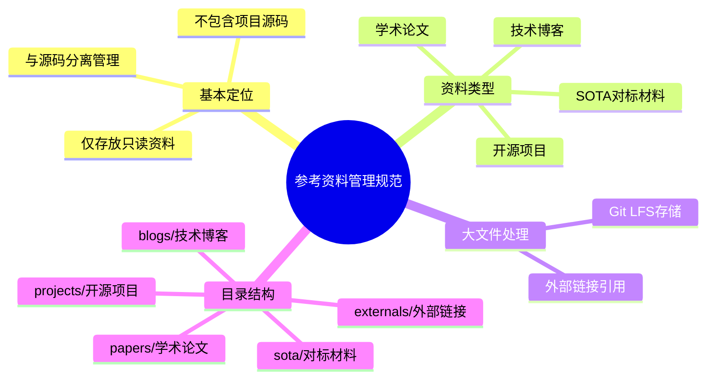

# 参考资料管理规范

## 定义

参考资料管理规范是一种项目仓库组织方法，其核心思想是将外部参考资料与项目源代码在物理层面进行分离，存放在独立的专用目录中。这种规范明确了参考资料目录的定位、功能边界和使用准则，确保团队成员能够清晰地区分和管理不同类型的项目资产。

从技术角度来看，参考资料管理规范本质上是一种**关注点分离（Separation of Concerns）**原则在项目组织中的具体应用。它将“活跃开发的源代码”与“相对稳定的参考资料”划分为两个独立的关注领域，从而降低它们之间的耦合度，减少相互干扰。

参考资料管理规范的核心特征包括：只读性（参考资料通常不进行主动修改）、外部性（多为外部资源的引用或摘录）、辅助性（服务于项目开发但不属于项目核心产出）。这一规范通常在项目的 README 或 CONTRIBUTING 文档中进行说明和约定。

## 解决什么问题

在软件开发过程中，团队经常需要参考和学习大量的外部资源，包括开源项目、学术论文、技术博客、SOTA 对标材料等。如果不对这些资料进行规范管理，会产生一系列问题：

**仓库结构混乱问题**：当参考资料与源代码混杂存放时，目录结构变得臃肿且难以理解。新成员加入项目时，很难快速定位到真正需要修改的源代码，降低了团队协作效率。

**版本控制冲突问题**：源代码是需要频繁修改和版本控制的资产，而参考资料通常保持静态。如果两者混合管理，在执行 git 操作时容易产生不必要的冲突和噪音，影响开发流程的流畅性。

**许可证合规风险**：外部参考资料可能涉及不同的许可证条款（GPL、MIT、Apache 等），混合存放可能导致许可证合规管理变得复杂，难以清晰识别哪些文件受哪些许可证约束。

**存储空间浪费问题**：一些参考资料体积较大（如预训练模型、二进制数据集等），如果全部直接存入仓库，会导致仓库体积膨胀，影响克隆速度和 CI/CD 性能。

**知识传承困难问题**：没有统一的参考资料管理机制，团队成员各自保存参考资料，导致知识分散，难以形成系统性的技术积累和传承。

参考资料管理规范通过设立独立的 reference 目录，集中管理所有外部参考资料，从根本上解决了上述问题。

## 工作原理

### 目录结构设计

参考资料管理规范的核心是建立一个与源代码目录并列的独立目录层级。典型的项目结构如下：

```
project-root/
├── src/                    # 项目源代码目录
├── reference/              # 参考资料专用目录（新建）
│   ├── projects/           # 开源项目案例
│   ├── papers/             # 学术论文
│   ├── blogs/              # 技术博客
│   ├── sota/               # SOTA 对标材料
│   └── externals/          # 外部链接索引
├── docs/                   # 项目文档
├── tests/                  # 测试代码
├── README.md               # 项目说明
└── .gitignore              # Git 忽略规则
```

### 文件分类机制

规范通常要求将参考资料按照类型进行分类：

| 资料类型 | 存放位置 | 典型内容 | 管理策略 |
|---------|---------|---------|---------|
| 开源项目 | reference/projects/ | 完整项目代码、Demo | 完整 clone 或 submodule |
| 学术论文 | reference/papers/ | PDF、arXiv 链接 | 仅保留链接或核心摘要 |
| 技术博客 | reference/blogs/ | 文章摘录、笔记 | Markdown 格式存档 |
| SOTA 材料 | reference/sota/ | 对标分析、基准测试 | 结构化文档 |

### 大文件处理流程

对于超过特定阈值的大文件（如 > 50MB），规范提供两种处理策略：

**策略一：Git LFS 存储**

```bash
# 安装 Git LFS
git lfs install

# 追踪特定文件类型
git lfs track "*.model"
git lfs track "*.dataset"

# 提交 .gitattributes
git add .gitattributes
git commit -m "Add LFS tracking"
```

Git LFS 的工作原理是将大文件的实际内容存储在 LFS 服务器上，仓库中仅保留指向这些内容的指针文件（Pointer File）。指针文件体积很小（通常 < 1KB），因此克隆仓库时速度不会受到大文件影响。

**策略二：外部链接引用**

对于可以通过网络公开获取的大文件，仅保留外部链接：

```markdown
# reference/externals/model-links.md

## 预训练模型

- ResNet-50: https://download.pytorch.org/models/resnet50-0676ba61.pth
- BERT-Base: https://huggingface.co/bert-base-uncased/resolve/main/pytorch_model.bin
```

### 访问控制机制

规范通常约定参考资料目录为只读状态，团队成员不应主动修改其中内容。如需更新参考资料，应通过特定流程（如提交 Issue、Pull Request）进行审查和批准。

## 关键方法

### 方法一：分层分类法

按照资料的来源和用途，将参考资料分为多个层级：

- **核心层**：与项目技术方向直接相关的论文和开源项目
- **拓展层**：相关领域的研究进展和实践案例
- **索引层**：外部链接和参考资料索引

### 方法二：版本锁定法

对于重要的参考资料（如特定版本的论文或开源项目），在目录中记录其版本信息，便于后续追溯和复现：

```markdown
# reference/papers/important-paper.md

## 文献信息

- 标题：Attention Is All You Need
- 作者：Vaswani et al.
- 年份：2017
- 引用：Transformer
- 版本锁定：arXiv:1706.03762 (v5)

## 核心摘要

...（文章核心内容摘录）
```

### 方法三：变更日志维护

对于需要持续更新的参考资料，建立变更日志记录其更新历史：

```markdown
# reference/CHANGELOG.md

## 2026-05-02

- 添加 ResNet 官方实现代码对标材料
- 更新 Transformer 论文至 v7 版本
- 补充 3 篇最新 CLIP 相关论文

## 2026-04-15

- 初始化 reference 目录结构
- 添加 BERT、GPT 系列论文存档
```

## 典型应用

### 应用场景：AI 研究项目

假设一个团队正在开发一个基于 Transformer 的图像分类项目，应用参考资料管理规范的典型流程如下：

**第一步：识别参考资料需求**

团队确定需要参考的外部资料包括：
- Transformer 原论文（用于理解架构原理）
- ViT（Vision Transformer）实现（用于技术对标）
- ImageNet 数据集官方说明（用于数据集管理）

**第二步：目录初始化**

```bash
mkdir -p reference/{papers,projects,sota,datasets}
touch reference/CHANGELOG.md
```

**第三步：资料归档**

```bash
# 克隆开源项目作为 submodule
git submodule add https://github.com/google-research/vision_transformer reference/projects/vit

# 论文 PDF 和摘要存档
cp ~/Downloads/attention_is_all_you_need.pdf reference/papers/
echo "## Transformer 核心要点\n\n- 自注意力机制\n- 多头注意力\n- 位置编码" > reference/papers/transformer-summary.md

# 大数据集仅保留链接
echo "- ImageNet: http://image-net.org/download" > reference/datasets/imagenet-links.md
```

**第四步：规范使用**

团队成员在开发过程中，需要理解注意力机制时，直接查阅 reference/papers/transformer-summary.md；在需要对标最新技术时，查看 reference/sota/ 目录下的分析文档。

**效果**：代码仓库保持整洁，参考资料集中有序，新成员可以通过 reference 目录快速了解项目技术背景和对标方向。

## 与其他概念的对比

### 与文档管理规范的区别

| 对比维度 | 参考资料管理规范 | 文档管理规范 |
|---------|-----------------|-------------|
| 资料来源 | 外部资料为主 | 项目内部产出为主 |
| 更新频率 | 相对稳定，变动较少 | 随项目迭代持续更新 |
| 编辑权限 | 通常只读 | 团队成员共同维护 |
| 存放位置 | reference/ 目录 | docs/ 目录 |
| 核心目的 | 学习和对标 | 项目说明和协作 |

### 与代码模块化设计的区别

两者虽然都遵循关注点分离原则，但分离的对象不同：

- **代码模块化**：将项目内部代码按功能划分为独立模块，强调代码内部组织
- **参考资料管理**：将外部资料与源代码分离，强调项目整体结构

### 与 Git Submodule 的区别

Git Submodule 是一种技术手段，用于在仓库中嵌入其他 Git 仓库的引用。参考资料管理规范是一种更高层次的项目组织原则，Git Submodule 可以作为实现这一规范的技術工具之一（用于引用开源项目）。

## 常见误区

### 误区一：参考资料越多越好

**错误做法**：不加筛选地将所有可能相关的资料都放入 reference 目录。

**正确做法**：只保留真正有价值、对项目有直接帮助的参考资料，定期清理过时或无价值的内容。

### 误区二：忽视大文件管理

**错误做法**：将所有参考资料（包括大文件）直接提交到仓库。

**正确做法**：对大文件使用 Git LFS 或外部链接策略，避免仓库体积膨胀。

### 误区三：参考资料与源代码混杂

**错误做法**：在源代码目录中夹杂参考资料文件，或在 reference 目录中放置需要开发的代码。

**正确做法**：严格遵守目录划分原则，保持 source/ 和 reference/ 的边界清晰。

### 误区四：只存不管

**错误做法**：将资料放入 reference 目录后就不再维护。

**正确做法**：建立定期审查机制，及时更新重要资料的版本，清理失效链接。

### 误区五：忽略许可证合规

**错误做法**：将所有参考资料视为公共资源，不考虑许可证限制。

**正确做法**：在使用参考资料时，遵守其许可证要求；对于有特殊许可要求的资料，单独标注和管理。

## 关联知识

### [[entity-reference-directory|reference 目录]]

reference 目录是参考资料管理规范的物理载体，是项目中专门划分的用于存放只读参考资料的顶级目录。一个结构良好的 reference 目录应当具备清晰的子目录划分和完善的索引机制。

### [[concept-git-lfs|Git LFS]]

Git Large File Storage 是实现参考资料管理规范的重要技术工具。它解决了大体积参考资料（如预训练模型、数据集）的存储问题，使得 reference 目录能够容纳必要的二进制文件而不影响仓库性能。

### 版本控制系统最佳实践

参考资料管理规范是版本控制系统最佳实践的组成部分。通过合理的目录结构设计和文件管理策略，可以保持仓库的整洁、高效和可维护性，同时便于团队协作和知识传承。

### 待探讨

1. **自动化更新机制**：是否可以建立外部参考资料的自动更新机制，在论文发布或开源项目更新时自动提醒团队？

2. **智能分类系统**：是否可以开发工具自动识别和分类新加入的参考资料，减少人工维护成本？

3. **搜索与检索**：在参考资料数量较多时，如何建立高效的搜索和检索机制？是否需要引入知识图谱或语义搜索？

4. **质量评估标准**：如何评估参考资料的质量和价值？如何建立参考资料的质量分级体系？

---

## 来源

本概念页面内容整理自项目仓库文档（src-20260502-readme）。


<div align="right" style="opacity: 0.5; font-size: 0.8em;">✨ <i>Compiled by MiniMax-M2.7-highspeed</i></div>


## 图示



> 参考资料管理规范的层次结构思维导图，展示基本定位、资料类型、大文件处理和目录结构四大维度
